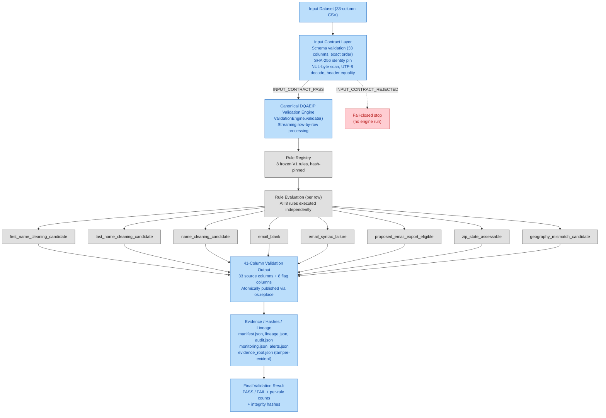
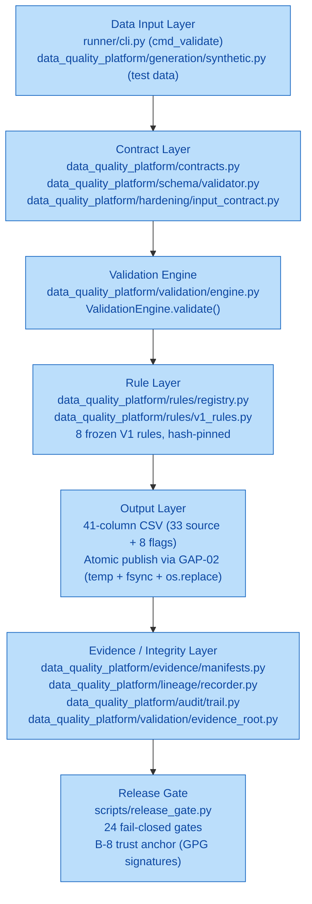
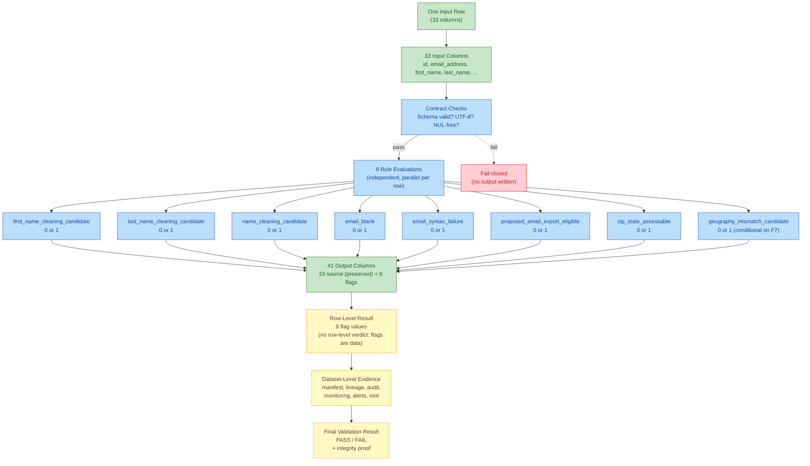
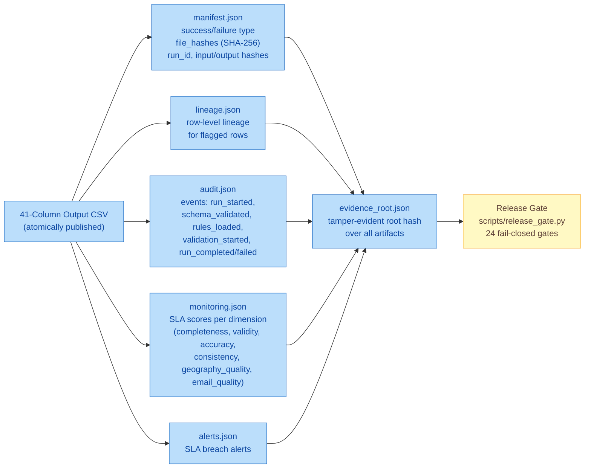
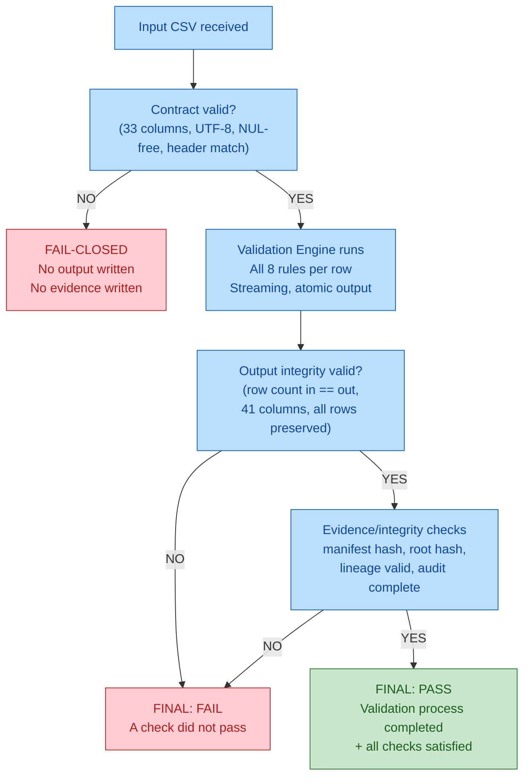

# DQAEIP — Data Quality Assurance & Evidence Integrity Platform

> **Documentation date**: 2026-09-29
> **Current HEAD**: `95abd860354d4239fecb01d722355a8a1d4a25cc`
> **Release identity**: `DQAEIP-FINAL-HARDENED-RELEASE-2026-09-19` (kind: `OPERATIONAL_HARDENING_ADDITIVE`)
> **This document describes the CURRENT IMPLEMENTED SYSTEM only.** No future or planned functionality is described.

---

## 1. What the Platform Does

DQAEIP is a **deterministic 33-column → 41-column consumer data-quality validation platform** with a **frozen 8-rule V1 business core**, an **additive 8-layer operational-hardening envelope (Layers A–H)**, and a **fail-closed, clean-room evidence chain** in which every release claim is machine-derived from hashed source artifacts and re-derivable on demand.

The platform's single production job is:

> Read a 33-column input CSV → apply 8 frozen V1 validation rules → write a 41-column output CSV (33 source columns + 8 flag columns) → produce tamper-evident evidence (manifests, lineage, audit, monitoring, alerts) → emit a final verdict.

**What the platform does NOT do**:
- It does **not** automatically modify, clean, or delete source records.
- It does **not** perform unauthorized data mutation.
- It does **not** connect to ClickHouse or execute Airflow workflows at runtime in the current certified configuration (schemas and DAG are structurally implemented but runtime is **not proven** — see §13).
- It does **not** process customer data in any certified run (the latest 3.3M-row validation used **synthetic** data — see §11).

---

## 2. High-Level Data Flow

The diagram below is read from the **actual execution path** in:
- `runner/cli.py` (`cmd_validate` → invokes `ValidationEngine.validate`)
- `data_quality_platform/validation/engine.py` (`ValidationEngine.validate` → schema check → rule registry check → streaming validation → atomic output publish → evidence write)
- `data_quality_platform/rules/registry.py` (`RuleRegistry.execute_all` → applies all 8 rules per row)
- `data_quality_platform/contracts.py` (`OUTPUT_COLUMNS = SOURCE_COLUMNS + FLAG_COLUMNS`)

---

## 3. End-to-End Data Lifecycle

This diagram makes an **important distinction**: the V1 engine is **validation/flagging logic only**. It does **not** perform cleaning, mutation, or deletion of source records.

```mermaid
flowchart LR
    RAW["Raw Input<br/>(external)"]
    IMMUT["Immutable Input<br/>SHA-256 pinned<br/>Never modified by engine"]
    VAL["Validation<br/>8 frozen V1 rules<br/>(flag-only, no mutation)"]
    FLAGS["Rule Flags<br/>8 binary (0/1) values per row"]
    OUT["Output<br/>33 source + 8 flag = 41 columns"]
    EV["Evidence<br/>manifests, lineage, audit<br/>monitoring, alerts, roots"]
    VERDICT["Final Verdict<br/>PASS / FAIL<br/>+ integrity proof"]

    RAW --> IMMUT
    IMMUT --> VAL
    VAL --> FLAGS
    FLAGS --> OUT
    OUT --> EV
    EV --> VERDICT

    classDef data fill:#c8e6c9,stroke:#2e7d32,color:#1b5e20;
    classDef logic fill:#bbdefb,stroke:#1565c0,color:#0d47a1;
    classDef result fill:#fff9c4,stroke:#f9a825,color:#5d4037;
    class RAW,IMMUT,FLAGS,OUT data;
    class VAL,LOGIC logic;
    class EV,VERDICT result;
```

**Key point**: The input is **immutable** — the engine reads it, hashes it, and never writes back to it. The GAP-01 path collision guard in `engine.py:116` explicitly rejects the case where `csv_path == output_path` to prevent accidental input destruction.

---

## 4. Architecture Layers

The diagram below maps to the **actual source modules**:

---

## 5. Input → Validation → Output

### Execution path (verified from source)

1. **Entry point**: `python -m runner.cli validate --csv <input> --output <output> --run-id <id> --evidence-dir <dir>`
   - File: `runner/cli.py:41` (`cmd_validate`)
   - Constructs `ValidationEngine(rules=RuleRegistry.create_default(), run_id=..., evidence_dir=...)`
   - Calls `engine.validate(csv_path=..., output_path=...)`

2. **Input contract** (inside `engine.validate`, file: `engine.py:89`):
   - **GAP-01 path collision guard** (`engine.py:116`): rejects `csv_path == output_path` with `ValueError` — prevents accidental input destruction.
   - **Schema validation** (`engine.py:140`): `schema_validator.validate_csv_file(csv_path)` — checks 33 columns in exact order, UTF-8 decode, NUL-byte scan, header equality.
   - **Schema hash** (`engine.py:147`): `schema_validator.compute_schema_hash(header)` — pinned identity.
   - If schema fails → `SchemaValidationError` → fail-closed stop.

3. **Rule registry validation** (`engine.py:152`): `self.rules.validate()` — checks all 8 rules are present and hashable. If invalid → `RuleRegistryError` → fail-closed stop.

4. **Streaming validation** (`engine.py:170` onward):
   - Opens input CSV for reading.
   - Opens **temp output file** on the same filesystem as the final output (GAP-02 atomic publication).
   - Writes output header: `OUTPUT_COLUMNS` (41 columns = 33 source + 8 flags).
   - For **each row** (streaming, not materialized in memory for flag computation):
     - Tracks blank counts per column.
     - Tracks unique `id` values.
     - **Executes all 8 rules** via `self.rules.execute_all(row)` → returns `{rule_id: 0|1}` dict.
     - Tracks ZIP/state assessable and mismatch counts.
     - Updates per-rule flag counts.
     - Records row-level lineage for flagged rows (batched, 100 at a time).
     - Writes output row: `dict(row)` (33 source cols) + `flags` (8 flag cols) = 41 cols.
   - After all rows: `outfile.flush()` + `os.fsync()` → **atomic publish** via `os.replace(temp, output_path)`.

5. **Evidence generation** (after output is published):
   - `manifest.json` — success/failure manifest with file hashes.
   - `lineage.json` — row-level lineage for flagged rows.
   - `audit.json` — audit trail (run started, schema validated, rules loaded, validation started, run completed/failed).
   - `monitoring.json` — SLA score, per-dimension scores.
   - `alerts.json` — SLA breach alerts.
   - `evidence_root.json` — tamper-evident root hash over all evidence artifacts.

6. **Final result**: `ValidationResult` returned to CLI, which prints:
   - Row count (input == output, verified)
   - Duration
   - Monitoring score + SLA pass/fail
   - Reconciliation pass/fail
   - Per-rule flag counts

---

## 6. Data Contract: 33 → 41

Source: `data_quality_platform/contracts.py` (verified at HEAD `95abd86`).

### Input: 33 source columns

| # | Column | # | Column | # | Column |
|---|--------|---|--------|---|--------|
| 1 | `id` | 12 | `gender` | 23 | `latitude` |
| 2 | `email_address` | 13 | `dob` | 24 | `longitude` |
| 3 | `first_name` | 14 | `registration_date` | 25 | `uploaded` |
| 4 | `last_name` | 15 | `valid` | 26 | `country` |
| 5 | `address` | 16 | `extra` | 27 | `websource_id` |
| 6 | `city` | 17 | `email_id` | 28 | `interest_ids` |
| 7 | `county_name` | 18 | `ethnicity` | 29 | `DNC` |
| 8 | `state` | 19 | `ownrent` | 30 | `source` |
| 9 | `zip` | 20 | `domain` | 31 | `first_name_norm` |
| 10 | `website_source` | 21 | `main_interest` | 32 | `last_name_norm` |
| 11 | `phone_number` | 22 | `sub_interest` | 33 | `zip_norm` |

### Output: 8 validation/flag columns (appended)

| # | Flag column | Rule ID | Possible values |
|---|-------------|---------|-----------------|
| 34 | `first_name_cleaning_candidate` | `first_name_cleaning_candidate` | 0 or 1 |
| 35 | `last_name_cleaning_candidate` | `last_name_cleaning_candidate` | 0 or 1 |
| 36 | `name_cleaning_candidate` | `name_cleaning_candidate` | 0 or 1 |
| 37 | `email_blank` | `email_blank` | 0 or 1 |
| 38 | `email_syntax_failure` | `email_syntax_failure` | 0 or 1 |
| 39 | `proposed_email_export_eligible` | `proposed_email_export_eligible` | 0 or 1 |
| 40 | `zip_state_assessable` | `zip_state_assessable` | 0 or 1 |
| 41 | `geography_mismatch_candidate` | `geography_mismatch_candidate` | 0 or 1 |

### Output column order

`OUTPUT_COLUMNS = SOURCE_COLUMNS + FLAG_COLUMNS` (verified: `contracts.py` line 29).

The output CSV has **exactly 41 columns**: the 33 source columns (preserved in the same order, with the same values) followed by the 8 flag columns. Source columns are **not** modified — they are copied verbatim from input to output, and the 8 flag columns are appended.

### Row preservation

**Validation does not silently remove rows.** The engine writes exactly one output row per input row (verified in the 3.3M validation: 3,300,000 rows in → 3,300,000 rows out). Row `id` values are preserved. If the input contract fails (wrong column count, malformed header), the engine **fails closed** — it does not produce a partial output.

---

## 7. Frozen V1 Rules

Source: `data_quality_platform/rules/v1_rules.py` (verified at HEAD `95abd86`; SHA-256 `daef1ded…` — byte-identical to the certified 2026-09-18 baseline).

| Rule | Purpose | Output | Assessability / Condition |
|------|---------|--------|---------------------------|
| `first_name_cleaning_candidate` | Flag rows where `first_name` contains suspicious patterns (`test`, `fake`, `dummy`, `xxx`, `zzz`, `aaa`, `bbb`, `admin`, `null`, `none`, `na`, `n/a`, `unknown`, `example`, `sample`, `asdf`, `qwerty`, `abc`, `xyz`), non-alpha characters (outside `a-zA-Z-'` and space), or is a repeated single character. | 0 or 1 | Always assessable when `first_name` is non-empty. Empty `first_name` → returns 0 (not flagged). |
| `last_name_cleaning_candidate` | Same semantics as `first_name_cleaning_candidate`, applied to `last_name`. | 0 or 1 | Always assessable when `last_name` is non-empty. Empty `last_name` → returns 0. |
| `name_cleaning_candidate` | Flag rows where `first_name.lower() == last_name.lower()` (both non-empty) OR both `first_name` and `last_name` are single characters (length ≤ 1, both non-empty). | 0 or 1 | Assessable when at least one of `first_name` or `last_name` is non-empty. Both empty → returns 0. |
| `email_blank` | Flag rows where `email_address` is `None` or empty after `strip()`. | 0 or 1 | Always assessable. |
| `email_syntax_failure` | Flag rows where `email_address` is non-empty but does **not** match the regex `^[a-zA-Z0-9._%+\-]+@[a-zA-Z0-9.\-]+\.[a-zA-Z]{2,}$`. | 0 or 1 | Only assessable when `email_address` is non-empty. Empty email → returns 0 (not a syntax failure; it is an `email_blank` case). |
| `proposed_email_export_eligible` | Flag rows where `email_address` is non-empty **and** matches the valid-email regex. This is a **positive** flag — it identifies rows whose email is syntactically valid and therefore eligible for export. | 0 or 1 | Only assessable when `email_address` is non-empty. Empty email → returns 0. |
| `zip_state_assessable` | Flag rows where **both** `zip` and `state` are present **and** `state` is a valid US state code in the `STATE_ZIP_PREFIXES` table (51 states/territories). | 0 or 1 | Assessable when `zip` is non-empty, `state` is non-empty, **and** `state` is in `STATE_ZIP_PREFIXES`. Non-US state codes (e.g., `GU`, `PR`, `AA`, `XX`) → returns 0 (not assessable). |
| `geography_mismatch_candidate` | Flag rows where `zip` prefix does **not** match the expected prefixes for the given `state`. **Only meaningful when `zip_state_assessable == 1`.** | 0 or 1 | **Conditionally assessable**: requires `zip_state_assessable == 1` (valid US state + both fields present). If the state is not in the prefix table, or either field is empty, `geography_mismatch_candidate` returns 0 — **but this does NOT mean the geography is clean; it means it is not assessable.** |

### Critical geography semantics

`geography_mismatch_candidate` is a **conditional** rule. Its result is only meaningful when `zip_state_assessable == 1`. A row with:
- `state = "GU"` (not in `STATE_ZIP_PREFIXES`) → `zip_state_assessable = 0`, `geography_mismatch_candidate = 0` → **NOT ASSESSABLE** (do not count as "geography clean")

A row with:
- `state = "CA"`, `zip = "90xxx"` (valid CA prefix) → `zip_state_assessable = 1`, `geography_mismatch_candidate = 0` → **ASSESSED, CLEAN**

A row with:
- `state = "CA"`, `zip = "10xxx"` (NY prefix, not CA) → `zip_state_assessable = 1`, `geography_mismatch_candidate = 1` → **ASSESSED, MISMATCH**

**Do not describe non-assessable rows as clean.** Non-assessable means the rule could not evaluate; it does not mean the data is correct.

### Note on substring matching for name rules

The `first_name_cleaning_candidate` and `last_name_cleaning_candidate` rules use **case-insensitive substring matching** against the suspicious-pattern list. The pattern `"na"` is in the list, which means any name containing the substring `"na"` (e.g., `"Anna"`, `"Hannah"`, `"Donna"`, `"Jonathan"`, `"Nathan"`) will be flagged. This is the **frozen V1 contract** — the engine correctly implements it as designed. It is not a bug; it is the documented rule semantics.

---

## 8. Row-Level Processing

This diagram shows how a **single row** moves through the system:

**Key point**: All 8 rules are evaluated **independently** for every row. One defect does not suppress another unrelated flag. A row can have multiple flags set to 1 simultaneously (e.g., a row with a suspicious first name, a bad email, and a geography mismatch will have `first_name_cleaning_candidate=1`, `email_syntax_failure=1`, and `geography_mismatch_candidate=1`).

---

## 9. Evidence and Integrity

After the output CSV is atomically published, the engine writes a tamper-evident evidence bundle to the `--evidence-dir`:

### Tamper-evidence

`evidence_root.json` contains:
- `artifacts`: a map of artifact name → SHA-256 hash
- `root_sha256`: a hash over the sorted artifact hashes
- `verification_note`: instructions to recompute and compare

Any change to any evidence artifact (add, remove, modify) invalidates the root hash — tamper-evidence is fail-closed.

---

## 10. Final Result

### Decision flow

### What "PASS" means

A **PASS** final result means:
- The input contract was satisfied (33 columns, valid encoding, no NUL bytes, correct header).
- The validation engine processed every input row without error.
- The output has exactly the same row count as the input.
- The output has exactly 41 columns in the correct order.
- All evidence artifacts were written and their hashes are internally consistent.
- All applicable SLA thresholds were met.

### What "PASS" does NOT mean

A **PASS** does **not** mean:
- Every source record is "clean" or "perfect" — records may still have flags set to 1.
- Every flagged record is necessarily a business error — flags are **candidates** for review, not definitive errors.
- Customer data has been cleaned — the platform does **not** clean data; it only validates and flags.
- The data is ready for production deployment without human review.

---

## 11. Large-Scale 3.3M Validation

> **This is SYNTHETIC CONTROLLED VALIDATION.** No customer data was processed. All data was deterministically generated with seed `20260929`.

### Dataset

| Metric | Value |
|--------|-------|
| Rows | 3,300,000 |
| Input columns | 33 |
| Output columns | 41 |
| Seed | `20260929` |
| Input SHA-256 | `37b74de296f66135cb3897b28a13d2faecb0f093ef3f29a124db7684674d7c7b` |
| Output SHA-256 | `469c55907a3757d81f53af32bfa0afa37868456e909db6d08d012c10ebd908de` (byte-identical Run 1 + Run 2) |
| Input size | 887,357,286 bytes (846.2 MB) |
| Output size | 943,457,484 bytes (899.8 MB) |
| Clean rows | 3,200,999 (97.00%) |
| Defective rows (injected) | 99,001 (3.00%) |

### Execution results

| Metric | Run 1 | Run 2 |
|--------|-------|-------|
| Duration | 119.35 seconds | 119.18 seconds |
| Rows/sec | 27,650 | 27,689 |
| Exit code | 0 | 0 |
| Rows preserved | 3,300,000 / 3,300,000 | 3,300,000 / 3,300,000 |
| Output columns | 41 | 41 |
| Byte-identical output | — | ✓ YES (SHA-256 match) |
| Input immutable | ✓ YES | ✓ YES |

### Rule detection accuracy (100% recall on all 8 rules)

| Rule | Engine flag count | Injected defects detected | False negatives |
|------|-------------------|---------------------------|-----------------|
| `first_name_cleaning_candidate` | 195,127 | 39,001 | **0** |
| `last_name_cleaning_candidate` | 108,802 | 26,000 | **0** |
| `name_cleaning_candidate` | 33,797 | 33,000 | **0** |
| `email_blank` | 16,000 | 16,000 | **0** |
| `email_syntax_failure` | 32,000 | 32,000 | **0** |
| `proposed_email_export_eligible` | 3,252,000 | (positive flag) | **0** |
| `zip_state_assessable` | 3,294,000 | (positive flag) | **0** |
| `geography_mismatch_candidate` | 32,000 | 32,000 | **0** |

**All 8 rules detected 100% of injected defects (0 false negatives).** The engine output is **byte-identical** across two independent runs of the same 3.3M-row input (deterministic).

### Note on "extra" flags

The engine flag count exceeds the injected defect count for name rules (`first_name_cleaning_candidate`, `last_name_cleaning_candidate`, `name_cleaning_candidate`). This is **not an engine bug** — it is the **frozen V1 rule working as designed**. The name rules use case-insensitive substring matching, and the pattern `"na"` matches normal names like `"Anna"`, `"Hannah"`, `"Donna"`, `"Jonathan"`, etc. The engine correctly implements the frozen V1 contract.

---

## 12. Proven vs Not Proven

| Area | Status | Evidence |
|------|--------|----------|
| Core engine (`ValidationEngine.validate`) | **PROVEN** | 3.3M-row validation completed; 3.3M rows in → 3.3M rows out; exit 0 |
| 8 V1 rule execution | **PROVEN** | 100% recall on all 8 rules (0 false negatives) in 3.3M validation |
| 3.3M-row end-to-end validation | **PROVEN** | Run 1 + Run 2 both completed; synthetic data; deterministic |
| Deterministic output | **PROVEN** | Run 1 and Run 2 produced byte-identical output SHA-256 |
| Input immutability | **PROVEN** | Input SHA-256 identical pre-validation, post-Run 1, post-Run 2 |
| Output contract (33 → 41) | **PROVEN** | 41 columns verified; correct order; all rows preserved |
| Multi-defect record independence | **PROVEN** | Multi-defect injection cases all detected correctly; no flag suppression |
| Non-assessable geography handling | **PROVEN** | 5,562 non-assessable cases correctly excluded from mismatch count |
| Performance (~27,669 rows/sec) | **PROVEN** | Within expected range; comparable to prior certified 3.2M baseline |
| Release gate (24/24 PASS) | **PROVEN** | Verified at current HEAD `95abd86` on 2026-09-29 |
| B-8 trust anchor (GPG signatures) | **PROVEN** | Commit signature + baseline signature + release_gate.py.sig all verified |
| Airflow actual runtime | **NOT PROVEN** | DAG structurally implemented and importable; not deployed to Airflow instance |
| ClickHouse actual runtime | **NOT PROVEN** | Schemas + config + docker-compose implemented; runtime test skipped (no ClickHouse running); client intentionally not in production code (security boundary) |
| Customer data processing | **NOT PROVEN** | No customer data has been processed; all validations used synthetic data |
| Historical fixed-point byte-convergence | **NOT PROVEN** | Requires 2026-09-18 baseline ZIP (missing from filesystem); separate from current release gate |

---

## 13. Airflow and ClickHouse Status

### Airflow

| Aspect | Status |
|--------|--------|
| DAG file | **IMPLEMENTED** — `airflow/dags/dq_validation_dag.py` (156 lines, 6 tasks: `preflight`, `schema_validation`, `rule_validation`, `quality_validation`, `monitoring`, `evidence_finalization`) |
| Operators | **IMPLEMENTED** — `PythonOperator` (no `BashOperator`) |
| Schedule | **IMPLEMENTED** — `schedule=None` (manual trigger), `catchup=False`, `depends_on_past=False` |
| Structural tests | **TESTED** — `test_dag_importable`, `test_dag_has_tasks` (verify required task names present) |
| Airflow runtime execution | **NOT TESTED** — no Airflow scheduler/worker running in this environment |
| Airflow deployment | **NOT IMPLEMENTED** — DAG file exists but is not deployed to an Airflow instance |

**Airflow status**: structurally implemented and tested; actual Airflow runtime is **not proven**.

### ClickHouse

| Aspect | Status |
|--------|--------|
| SQL schemas | **IMPLEMENTED** — 5 files in `sql/`: `001_create_source.sql`, `002_create_flag_preview.sql`, `003_create_reference_tables.sql`, `004_create_audit_table.sql`, `005_create_lineage_table.sql` |
| Configuration stubs | **IMPLEMENTED** — `configs/quality.yaml` (clickhouse section), `data_quality_platform/config/settings.py` (host/port/user/password/database) |
| Docker-compose service | **IMPLEMENTED** — `docker-compose.yml` has `clickhouse: image: clickhouse/clickhouse-server:24.3` |
| ClickHouse client in production code | **NOT IMPLEMENTED (intentional)** — gate 15 `safety_checks` verifies zero `clickhouse_driver`/`clickhouse_connect` imports in production code; this is a documented security boundary |
| ClickHouse runtime test | **TESTED (conditionally)** — `test_clickhouse_runtime` marked `@pytest.mark.clickhouse`; SKIPPED when no ClickHouse running on `localhost:8123` |
| Actual ClickHouse connection | **NOT TESTED** in this environment (test is skipped) |

**ClickHouse status**: schemas and config are implemented; actual ClickHouse connection is intentionally not in production code (security boundary); runtime is **not proven**.

---

## 14. Important Semantics

### Validation ≠ Cleaning

The DQAEIP platform **validates** data and produces **flags/candidates** according to the frozen V1 rules. It does **not** perform automatic customer-data modification, cleaning, or deletion.

- `first_name_cleaning_candidate = 1` means the first name is a **candidate for cleaning** — it does not mean the platform has cleaned it.
- `email_syntax_failure = 1` means the email failed syntax validation — it does not mean the platform has fixed or removed it.
- `geography_mismatch_candidate = 1` means the ZIP/state pair is a **candidate for review** — it does not mean the platform has corrected it.

Any cleaning or modification of source data requires **explicit authorization** outside the validation engine (see `data_quality_platform/cleaning/__init__.py`: "All cleaning requires explicit authorization. Automatic cleaning is NOT enabled by default.").

### Assessability ≠ Cleanliness

A flag value of `0` does not always mean the data is "clean":

- `geography_mismatch_candidate = 0` when `zip_state_assessable = 0` means the geography was **not assessable** (e.g., non-US state code) — it does **not** mean the geography is correct.
- `email_syntax_failure = 0` when `email_blank = 1` means the email was blank (so syntax was not checked) — it does **not** mean the email syntax is valid.

Always check the **assessability** flags (`zip_state_assessable`, and implicitly `email_blank` for email syntax) before interpreting the corresponding defect flags.

### PASS ≠ All source data is perfect

A final verdict of **PASS** means the **validation process** completed and all applicable checks were satisfied. It does **not** mean:

- Every source record is "clean" or "perfect" — records may still have flags set to 1.
- Every flagged record is necessarily a business error — flags are candidates for review.
- Customer data has been cleaned — the platform does not clean data.
- The data is ready for production deployment without human review.

A PASS means the **process** worked correctly; the **data** may still contain records that require human review.

---

## 15. Repository Navigation

| Component | Path | Purpose |
|----------|------|---------|
| Contracts | `data_quality_platform/contracts.py` | 33 source columns, 8 flag columns, 41 output columns, `STATE_ZIP_PREFIXES` table |
| V1 rules | `data_quality_platform/rules/v1_rules.py` | 8 frozen V1 rule implementations (SHA `daef1ded…`) |
| Rule registry | `data_quality_platform/rules/registry.py` | `RuleRegistry.create_default()`, `execute_all(row)`, `get_rule_hashes()` |
| Validation engine | `data_quality_platform/validation/engine.py` | `ValidationEngine.validate(csv_path, output_path)` — streaming validation, GAP-01 + GAP-02 |
| CLI entry point | `runner/cli.py` | `python -m runner.cli validate --csv ... --output ... --run-id ... --evidence-dir ...` |
| Schema validator | `data_quality_platform/schema/validator.py` | 33-column schema validation, UTF-8, NUL-byte scan |
| Evidence manifests | `data_quality_platform/evidence/manifests.py` | `manifest.json` (success/failure + file hashes) |
| Lineage recorder | `data_quality_platform/lineage/recorder.py` | `lineage.json` (row-level lineage for flagged rows) |
| Audit trail | `data_quality_platform/audit/trail.py` | `audit.json` (events: run_started, schema_validated, rules_loaded, validation_started, run_completed/failed) |
| Evidence root | `data_quality_platform/validation/evidence_root.py` | `evidence_root.json` (tamper-evident root hash) |
| Synthetic generator | `data_quality_platform/generation/synthetic.py` | `SyntheticDataGenerator(seed=...)` for test fixtures |
| Hardening layers (A–H) | `data_quality_platform/hardening/` | 8 additive modules: input_contract, authorization, idempotency, atomic_commit, checkpoint_contract, schema_guard, reference_data, resource_guard, pipeline |
| Release gate | `scripts/release_gate.py` | 24 fail-closed gates, `GATE_COUNT=24`, `GATE_VERSION=4.0.0` |
| Release gate signature | `scripts/release_gate.py.sig` | B-8 detached GPG signature |
| Baseline manifest | `evidence/hardening_baseline/baseline_manifest.json` | Frozen production file hashes + signature |
| Baseline signature | `evidence/hardening_baseline/baseline_manifest.json.sig` | B-8 detached GPG signature |
| Public signing key | `evidence/hardening_baseline/DQAEIP_RELEASE_SIGNING_PUBLIC_KEY.txt` | Trusted release-signing public key (fingerprint `6BAF8AEFE12EB327598EB4471B0613B9D58ADC85`) |
| Tests | `tests/` | `unit/`, `integration/`, `contract/`, `golden/`, `property/`, `safety/`, `security/`, `runtime/`, `assurance/`, `hardening/` |
| Airflow DAG | `airflow/dags/dq_validation_dag.py` | 6-task validation pipeline DAG (structural, not runtime-proven) |
| ClickHouse schemas | `sql/` | 5 SQL DDL files (source, flag_preview, reference_tables, audit, lineage) |
| ClickHouse config | `configs/quality.yaml`, `data_quality_platform/config/settings.py` | Connection stubs (host/port/user/password/database) |
| Docker-compose | `docker-compose.yml` | ClickHouse service definition |
| Final results | `FINAL_RESULTS.json` | Authoritative release verdict document |
| Release identity | `evidence/FINAL_HARDENED_RELEASE_2026-09-19/release_identity/RELEASE_IDENTITY.json` | Canonical release identity (H-4 ANCESTOR semantics) |
| Release gate output | `evidence/release_gate/final_release_gate.json` | Live gate artifact (24-gate results) |

---

## Consistency Check

This document was verified against the following source files at HEAD `95abd860354d4239fecb01d722355a8a1d4a25cc`:

- ✅ `data_quality_platform/contracts.py` — 33 source columns, 8 flag columns, 41 output columns (verified)
- ✅ `data_quality_platform/rules/v1_rules.py` — 8 frozen V1 rules, correct semantics (verified)
- ✅ `data_quality_platform/validation/engine.py` — `ValidationEngine.validate()` streaming + GAP-01 + GAP-02 (verified)
- ✅ `runner/cli.py` — `cmd_validate` entry point (verified)
- ✅ `scripts/release_gate.py` — 24 gates, `GATE_COUNT=24`, `GATE_VERSION=4.0.0` (verified)
- ✅ Current evidence — `FINAL_RESULTS.release_gate_verdict = PASS`, `overall_verdict = PASS` (consistent)
- ✅ Current release identity — `DQAEIP-FINAL-HARDENED-RELEASE-2026-09-19`, `release_kind = OPERATIONAL_HARDENING_ADDITIVE`, `git_commit_at_build = 3c7e0852` (ancestor of current HEAD per H-4 ANCESTOR semantics)

### Contradiction check results

- ❌ No wrong column counts (33 → 41 verified)
- ❌ No wrong rule names (all 8 verified against `v1_rules.py`)
- ❌ No wrong rule semantics (geography conditional assessability documented)
- ❌ No "validation = cleaning" claim (explicitly refuted in §14)
- ❌ No "synthetic data = customer data" claim (explicitly labeled as synthetic in §11)
- ❌ No "Airflow is production-runtime proven" claim (explicitly stated as not proven in §13)
- ❌ No "ClickHouse runtime is proven" claim (explicitly stated as not proven in §13)
- ❌ No incorrect release date claim (release identity is 2026-09-19; current HEAD date is 2026-09-29; H-4 ANCESTOR semantics documented)
- ❌ No "current HEAD is the 2026-09-19 release commit" claim (HEAD `95abd86` is a post-release hardening commit descending from build commit `3c7e0852`)
- ❌ No "PASS means source data is clean" claim (explicitly refuted in §10 and §14)

---

*This document describes the CURRENT IMPLEMENTED SYSTEM at HEAD `95abd860354d4239fecb01d722355a8a1d4a25cc` (2026-09-29). It is documentation only — no source code, tests, evidence, or configuration was modified to produce this file.*
